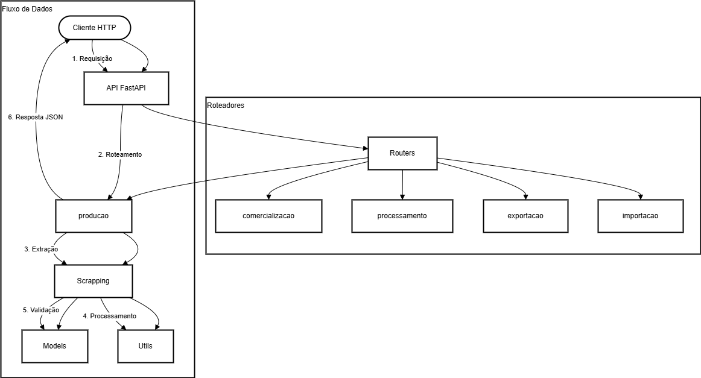

# API Embrapa - Vitivinicultura

API para extração e consulta de informações referentes à vitivinicultura, baseada em dados da Embrapa.

## Descrição

Este projeto consiste em uma API RESTful desenvolvida com FastAPI que fornece acesso a dados sobre vitivinicultura. A API extrai dados do portal Vitibrasil da Embrapa e os disponibiliza em formato JSON através de endpoints estruturados.

## Fluxograma do Projeto



## Categorias de Dados

A API fornece informações sobre:

- **Produção**: Dados sobre a produção de uvas e derivados
- **Comercialização**: Informações sobre a comercialização de produtos vitivinícolas
- **Processamento**: Dados sobre o processamento de uvas (viníferas, americanas, mesa e outros)
- **Exportação**: Estatísticas de exportação (vinhos de mesa, espumantes, uvas frescas e sucos)
- **Importação**: Estatísticas de importação (vinhos de mesa, espumantes, uvas frescas, passas e sucos)

## Tecnologias Utilizadas

- **FastAPI**: Framework web para construção de APIs
- **Docker**: Containerização da aplicação
- **Pandas**: Manipulação e análise de dados
- **Pydantic**: Validação de dados
- **PyYAML**: Processamento de arquivos YAML para configuração

## Requisitos

- Docker e Docker Compose
- Python 3.10+ (para desenvolvimento local)

## Instalação e Execução

### Usando Docker (Recomendado)

1. Clone o repositório:
   ```
   git clone <url-do-repositorio>
   cd embrapa-api
   ```

2. Crie um arquivo `.env` baseado no `.env.example`:
   ```
   cp .env.example .env
   ```

3. Para ambiente de desenvolvimento (com hot-reload):
   ```
   ./start-dev.bat
   ```
   ou
   ```
   docker-compose -f docker-compose.dev.yml up --build
   ```

4. Para ambiente de produção:
   ```
   ./start-prod.bat
   ```
   ou
   ```
   docker-compose up --build
   ```

### Instalação Local (Desenvolvimento)

1. Clone o repositório:
   ```
   git clone <url-do-repositorio>
   cd embrapa-api
   ```

2. Crie e ative um ambiente virtual:
   ```
   python -m venv venv
   venv\Scripts\activate  # Windows
   source venv/bin/activate  # Linux/Mac
   ```

3. Instale as dependências:
   ```
   pip install -r requirements.txt
   ```

4. Execute a aplicação:
   ```
   uvicorn app.main:app --reload
   ```

## Uso da API

A API estará disponível em `http://localhost:8000`.

### Documentação Swagger

Acesse a documentação interativa da API em:
- `http://localhost:8000/docs`

### Endpoints Principais

- **GET /producao**: Retorna dados de produção
- **GET /comercializacao**: Retorna dados de comercialização
- **GET /processamento**: Retorna dados de processamento
- **GET /exportacao**: Retorna dados de exportação
- **GET /importacao**: Retorna dados de importação

### Exemplos de Filtros

Cada categoria possui endpoints para filtrar dados:

- **Por categoria**: `/producao/categoria/{categoria}`
- **Por produto**: `/producao/produto/{produto}`
- **Por ano**: `/producao/ano/{ano}`
- **Por quantidade mínima**: `/producao/quantidade/min/{quantidade}`
- **Por quantidade máxima**: `/producao/quantidade/max/{quantidade}`
- **Filtros combinados**: `/producao/filter?categoria=X&produto=Y&ano=2022`

## Estrutura do Projeto

```
embrapa-api/
├── app/
│   ├── models/          # Modelos de dados
│   ├── routers/         # Rotas da API
│   ├── scrapping/       # Módulos para extração de dados
│   ├── utils/           # Funções utilitárias
│   └── main.py          # Ponto de entrada da aplicação
├── docker-compose.dev.yml  # Configuração Docker para desenvolvimento
├── docker-compose.yml      # Configuração Docker para produção
├── Dockerfile              # Definição da imagem Docker
├── requirements.txt        # Dependências do projeto
└── README.md               # Este arquivo
```

## Fonte dos Dados

Os dados são extraídos do portal Vitibrasil da Embrapa:
- [http://vitibrasil.cnpuv.embrapa.br/](http://vitibrasil.cnpuv.embrapa.br/)